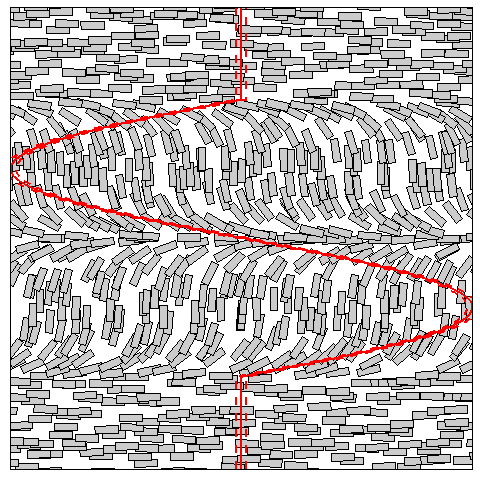
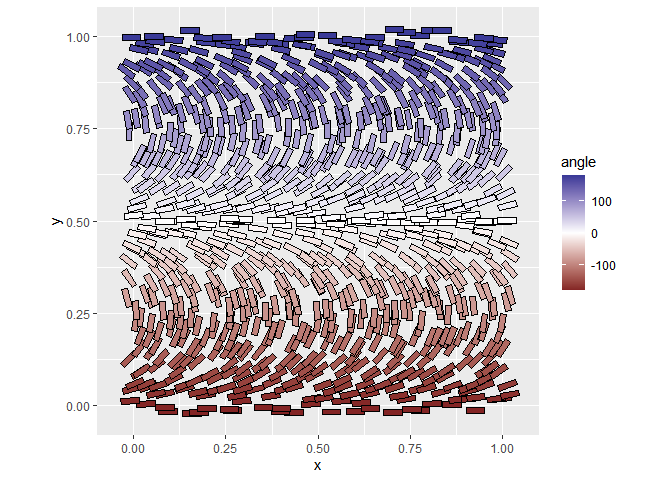

<!-- README.md is generated from README.Rmd. Please edit that file -->

# gglcd 

**`gglcd` is a work in progress - it may not be working properly, so use
it at your own risk\!**

The goal of `gglcd` is to programmatically create schematic liquid
crystal (LC) alignment diagrams.

`gglcd` has two features:

  - A ggplot2 geom and stat (`geom_lc()` and `stat_lc()`) for fine
    control
  - A convenient wrapper function `lcd()` for simple alignment diagrams

## Example use

``` r
library(gglcd)
library(tidyverse)
```

For quick LC alignment diagrams you can use `lcd()` and specify the
bottom and top anlgle arguments. Under the hood, this is creating an
`angle_function` (the third argument to `lcd()`) that varies the angle
linearly from the bottom of the diagram to the top of the diagram. Note
that all themeing can be removed by setting `themeing = FALSE`. Setting
a seed ensures that the same diagram can be recreated.

``` r
lcd(45, -45, seed=1)
```

<!-- -->

``` r
lcd(45, -45, seed=1, themeing = FALSE)
```

<!-- -->

The vertical y-scale of the plotting area always ranges from 0 to 1 (so
the plotting area always has a height of 1). The width of the diagram
can be varied by specifying the `diagram_aspect` argument which is
defined as width/length. `lcd()` returns a ggplot2 object, so further
layers cab be added as normal

``` r
lcd(0, 90) + 
  geom_hline(yintercept = 0.5, col="orange", size=2)+
  labs(title = "Title", subtitle = "Subtitle")
```

<!-- -->

There are a whole load of other arguments to `lcd()` to control the
format of the output

``` r
args(lcd)
#> function (angle_b = 0, angle_t = 90, angle_function = NULL, angle_n = 0, 
#>     n_mol_x = 30, n_mol_y = 30, x_jitter = 0.4, y_jitter = 0.4, 
#>     lc_length = 0.05, lc_width = 0.016, diagram_aspect = 1, seed = NULL, 
#>     surface_b = NULL, surface_t = NULL, lc_shape = "rectangle", 
#>     ellipse_res = 35, return_df = FALSE, themeing = TRUE, show_function = FALSE, 
#>     lc_lwd = 0.2, surface_b_lwd = 0.2, surface_t_lwd = 0.2, bg_lwd = 0.2, 
#>     lc_fill = "grey80", lc_col = "black", bg_fill = "white", 
#>     bg_col = "black", surface_b_fill = "black", surface_b_col = NA, 
#>     surface_t_fill = "black", surface_t_col = NA) 
#> NULL
```

For example, the aspect of the diagram can be changed, bounding surfaces
applied and colour elements edited.

``` r
lcd(0, 360, 
    diagram_aspect = 2, 
    surface_b = 0.1, surface_t = 0.05, 
    bg_fill = "aquamarine", lc_fill="white")
```

<!-- -->

Non-linear changes in angle can also be specified by the
`angle_function` argument. Here I create a sinusoidally varying angle
between 0.2 and 0.8 (the vertical scale of the plot is always 0 to 1).

``` r
x <- seq(0.2,0.8,l=1000)
y <- sin(seq(0,2*pi,l=1000))*90
af <- approxfun(x,y, rule=2)

lcd(angle_function = af, seed=1, show_function = TRUE, angle_n=2)
```

<!-- -->

## Geoms and stats

The `lcd()` function described above is a wrapper aronud `geom_lc()` and
`stat_lc()`. These functions can be used as normal with a call to
`ggplot()` for full control over the diagram creation, including the
ability to make additional aesthetic mappings.

A particularly useful argument to `lcd()` is `return_df`. If set to
`TRUE` (default is `FALSE`), a dataframe of the required aesthetic
mappings (x, y, angle, length, width) is returned, rather than a plot.
This is a convenient way to produce a dataframe that can be passed to
`ggplot()` (example below).

This example also makes use of the ability to map non-required
aesthetics. The fill is mapped to angle.

``` r
lcd(-180, 180, return_df = T, seed=1) %>%
  print() %>% # view dataframe
  ggplot(aes(x, y, angle=angle, length=length, width=width))+
  geom_lc(aes(fill=angle))+
  coord_fixed()+
  scale_fill_gradient2()
#> # A tibble: 900 x 5
#>         x       y width length angle
#>     <dbl>   <dbl> <dbl>  <dbl> <dbl>
#>  1 0.158  -0.0198 0.016   0.05  -180
#>  2 0.177  -0.0182 0.016   0.05  -180
#>  3 0.434  -0.0178 0.016   0.05  -180
#>  4 0.702  -0.0171 0.016   0.05  -180
#>  5 0.536  -0.0170 0.016   0.05  -180
#>  6 0.601  -0.0164 0.016   0.05  -180
#>  7 0.398  -0.0156 0.016   0.05  -180
#>  8 0.0930 -0.0147 0.016   0.05  -180
#>  9 0.776  -0.0139 0.016   0.05  -180
#> 10 0.268  -0.0136 0.016   0.05  -180
#> # ... with 890 more rows
```

<!-- -->

As length is a required aesthetic for `geom_lc()`, it can be varied per
LC molecule. Here I have created a function that returns the length as a
function of the position in y for the ‘twist’ category (approximating
the projection of the rotated molecule onto the x-y plane). This is then
mutated onto the dataframe before plotting.

``` r
# Define inputs
lc_length <- 0.05
lc_width <- lc_length/3

# Approximate the length projection on to the x-y plane
twist_proj <- approxfun(seq(0,1,l=1000), cos(seq(0, pi/2, l=1000))*lc_length)

bind_rows(
  lcd(50, -50, lc_length=lc_length, lc_width=lc_width, return_df = TRUE) %>% mutate(label = "Splay"),
  lcd(50, 130, lc_length=lc_length, lc_width=lc_width, return_df = TRUE) %>% mutate(label = "Bend"),
  lcd(0, 0, lc_length = lc_length, lc_width=lc_width, return_df = TRUE) %>% 
    mutate(length = twist_proj(y),
           length = case_when(length < lc_width ~ lc_width,
                              TRUE ~ length),
           label = "Twist")
  ) %>% 
  ggplot(aes(x, y, angle=angle, length=length, width=width))+
  geom_lc()+
  facet_wrap(~label)+
  coord_fixed()+
  theme(legend.position = "none")
```

<!-- -->

### Using ellipse polygons

If using the `lc_shape = 'ellipse'` option, a further argument
`ellipse_res` can be used to control the number of equally spaced points
(in angle) that make up each individual ellipse. The default is
`ellipse_res = 35`

``` r
tibble(x=0.5, y=0.5, angle=45, length=1, width=1/4) %>% 
  ggplot(aes(x, y, angle=angle, length=length, width=width))+
  geom_polygon(stat="lc", aes(col="rectangle"), fill=NA, size=1)+
  geom_polygon(stat="lc", lc_shape='ellipse', ellipse_res = 60, aes(col="ellipse_res = 60"), fill=NA, size=1)+
  geom_polygon(stat="lc", lc_shape='ellipse', ellipse_res = 35, aes(col="ellipse_res = 35"), fill=NA, size=1)+
  geom_polygon(stat="lc", lc_shape='ellipse', ellipse_res = 10, aes(col="ellipse_res = 10"), fill=NA, size=1)+
  geom_polygon(stat="lc", lc_shape='ellipse', ellipse_res = 5, aes(col="ellipse_res = 05"), fill=NA, size=1)+
  coord_fixed()
```

<!-- -->

## Animations

With the super useful `gganimate` package it is also possible to create
custom animations using `geom_lc()`.
<!-- -->
